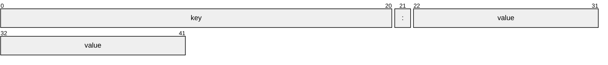

# Project 1: Multicast Server for Receiving and Printing Key-Value Pairs in C

## Intro

This project implements a server that listens for key-value pair messages over [multicast](https://en.wikipedia.org/wiki/Multicast#IP) using UDP sockets. 

The server joins a multicast group, receives messages from a client, and prints the key-value pairs in a neatly formatted manner with each key and value displayed in 20-character fields.


## Contents

   -  Assignment [details](ASSIGNMENT.md)
   -  [Getting Started](#getting-started)
   -  [Design](#design)
   -  [Testing](#testing) [](https://github.com/CSE-5462-OSU-Spring2025/lab1-jLevere/actions/workflows/main.yaml)


## Getting Started


To compile the code you have a few options, use the [development enviroment](#enviroment-setup), or [directly install](#direct-zig-install) the zig compiler.

### Enviroment setup

To use the included nix flake based development enviroment, you can either use `direnv` by running `direnv allow` or you can start the nix flake directly with `nix develop`.

To learn more about how awesome nix is, see [how-nix-works](https://nixos.org/guides/how-nix-works/) and the [nix-installer](https://github.com/DeterminateSystems/nix-installer).

### Direct Zig Install

On MacOS you can install the nix compiler via homebrew with `brew install zig` which will install verssion `0.13.0`.  This code uses `0.14.0` but most things should still work.  Homebrew is lagging behind a little with releases, but it should hopefully update in the next few weeks.

For other operating systems, please refer the list of supported package managers [here](https://github.com/ziglang/zig/wiki/Install-Zig-from-a-Package-Manager) or directly download the binaries from [here](https://ziglang.org/learn/getting-started/).

### Get the Server

You can compile the code yourself with `zig build` or download a binary compiled for x86-64 linux from the [releases](https://github.com/CSE-5462-OSU-Spring2025/lab1-jLevere/releases/latest/).

### Usage

To run the server simply run the server binary with an ip address and port.  This ip address can be either a normal ip address, or multicast.  In the case of multicast, the server will automatically join the correct multicast group based on the provided address.

```
./server 224.0.0.1 8011
```


## Messages

### Format

Messages are Key Value pairs seperated by a colon ':'. The Key is unquoted but can not contain spaces. They key is followed by the colon ':' which is followed by a Key, which can either be a quoted string, or a numerical value, optionally with an appended string containing no spaces. Both the key and value can not exceed 20 characters in length. Messages are seperated by white space.



A simple example is as follows:
```
key: "value"   key: 12kb
```

### Edge cases

We should be permissive on the parsing, and strict on the generation as is typical in networking.  This helps with reliability and fault tolerance.

If we are not able to parse something, we should move forwared and try again.  This should help with skiping damaged data while still making attempt to deal with it.

Here are some strategies for edges cases:


| case | assumption | parsing attempt |
| ----------------------------------------------|--------------|----------------------------------|
| Can messages be broken by UDP packet boundaries| no | ignore |
| Key without a value | no | look for next ':' to find next key and backtrack to find next key |
| Missmatched quotes | no | look for ':' to find next key and backtrack to isolate k:v |
| duplicate keys | no | dont update as that is sharp |
| un escaped control char in k or v | no | treat literally and backtrack to deal with |
|  utf8 | no | not much can do |
| value or key longer than 20 | no | truncate. sharp but fault tolerant |


Some valid and invalid messages
```
File_Name:"is okay"
this_value_is_okay:12KB
this: "is a pair with space"
this:
"is okay too"
this is:"a bad key"
Description:"this value is too long"
this_1: "is okay too"
2nd_is: "good too"
```

## Design

### Plan

We should recive a udp packet, parse it into a hashmap, and then print the hashmap.  That is generally the work flow.

We should allocate a hashmap on each packet that has data in it, and then we should destroy it when it is done so that we dont grow too large.

## Testing

Unit tests can be run with the zig compiler by running `zig build test`.  The unit tests are also run by a github action which will display if the push passes tests or not.

For intigration testing, there is a provided client and data file in the [provided materials](./provided_materials/) directory.