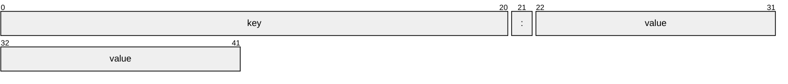

# Project 1: Multicast Server for Receiving and Printing Key-Value Pairs in C

## Intro

This project implements a server that listens for key-value pair messages over [multicast](https://en.wikipedia.org/wiki/Multicast#IP) using UDP sockets. 

The server joins a multicast group, receives messages from a client, and prints the key-value pairs in a neatly formatted manner with each key and value displayed in 20-character fields.


## Contents

   -  Assignment [details](ASSIGNMENT.md)


## Notes

- K, V pairs dont have to be ordered, so a hashmap would be a nice data structure
- both keys and values can only be 20 characters (not bytes, chars)


## Messages

### Format

Messages are Key Value pairs seperated by a colon ':'. The Key is unquoted but can not contain spaces. They key is followed by the colon ':' which is followed by a Key, which can either be a quoted string, or a numerical value, optionally with an appended string containing no spaces. Both the key and value can not exceed 20 characters in length. Messages are seperated by white space.



A simple example is as follows:
```
key: "value"   key: 12kb
```

### Edge cases

We should be permissive on the parsing, and strict on the generation as is typical in networking.  This helps with reliability and fault tolerance.

If we are not able to parse something, we should move forwared and try again.  This should help with skiping damaged data while still making attempt to deal with it.

Here are some strategies for edges cases:


| case | assumption | parsing attempt |
| ----------------------------------------------|--------------|----------------------------------|
| Can messages be broken by UDP packet boundaries| no | ignore |
| Key without a value | no | look for next ':' to find next key and backtrack to find next key |
| Missmatched quotes | no | look for ':' to find next key and backtrack to isolate k:v |
| duplicate keys | no | dont update as that is sharp |
| un escaped control char in k or v | no | treat literally and backtrack to deal with |
|  utf8 | no | not much can do |
| value or key longer than 20 | no | truncate. sharp but fault tolerant |


Some valid and invalid messages
```
File_Name:"is okay"
this_value_is_okay:12KB
this: "is a pair with space"
this:
"is okay too"
this is:"a bad key"
Description:"this value is too long"
this_1: "is okay too"
2nd_is: "good too"
```