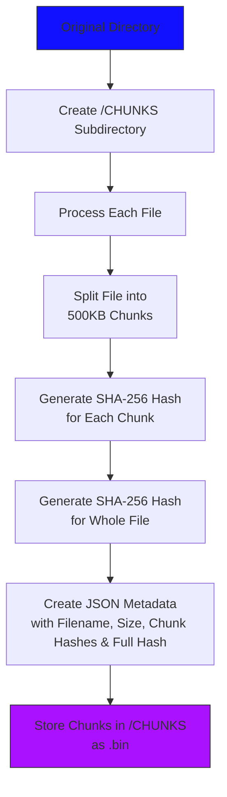

# Project #3: File Chunking and Hashing for Integrity Verification

## Intro

This project focuses on verifying file integrity by splitting files into 500KB chunks, generating SHA-256 hashes for each chunk and the entire file, and organizing this data into structured JSON metadata. 

It builds on existing code to ensure files are hashed, chunked, and validated before transfer, maintaining data integrity for storage or transmission. 

The JSON output provides a human-readable record of filenames, sizes, chunk counts, and cryptographic hashes for both individual segments and complete files.


## Contents
- Assignment [details](ASSIGNMENT.md)
- [Getting Started](#getting-started)
- [Design](#design)
- [Key Concepts](#key-concepts)
- [Testing](#testing) [](https://github.com/CSE-5462-OSU-Spring2025/lab3-jLevere/actions/workflows/main.yaml)


## Getting Started


To compile the code you have a few options, use the [development enviroment](#enviroment-setup), or [directly install](#direct-zig-install) the zig compiler.

### Enviroment setup (HIGHLY RECOMENDED)

To use the Nix flake-based development environment:
```bash
direnv allow  # or
nix develop
```

This will ensure that the LSP, compiler and library versions are all in sync using the `flake.lock` file.

To learn more about how awesome nix is, see [how-nix-works](https://nixos.org/guides/how-nix-works/) and the [nix-installer](https://github.com/DeterminateSystems/nix-installer).

### Direct Zig Install

For MacOS (via Homebrew):
```bash
brew install zig  # v0.13.0 (0.14.0-dev.2851+b074fb7dd recommended)
```
Other systems: [Download binaries](https://ziglang.org/learn/getting-started/) or check [supported package managers](https://github.com/ziglang/zig/wiki/Install-Zig-from-a-Package-Manager).

### Compilation & Usage

Compile with `zig build` or download pre-built binaries from [releases](https://github.com/CSE-5462-OSU-Spring2025/lab3-jLevere/releases/latest/).

### Usage


```
./server 8011
```

```
./client FILES/ --ip 224.0.0.1 --port 8011
```

## Design


Steps: 
- `Client` is given a directory containing some number of files
- `Client` creates a subdirectory in the input directory `CHUNKS`
- `Client` iterates through the files
    - Break files into 500kb chunks, each named its hash
    - Add metadata to the json object
    - Write this object out, named the file hash.json
- `Client` Read the index of each files in `CHUNKS` and send it 
to the broadcast group


### JSON Object Structure
Each JSON object should contain:
- `"filename"`: Original filename of the file.
- `"fileSize"`: Total size of the file in bytes.
- `"numberOfChunks"`: Number of chunks the file was split into.
- `"chunk_hashes"`: Array of SHA-256 hashes for each chunk.
- `"fullFileHash"`: SHA-256 hash for the entire file.

```json
     {
       "filename": "ExampleFile.jpeg",
       "fileSize": 1234567,
       "numberOfChunks": 6,
       "chunk_hashes": [
         "hash_chunk_1",
         "hash_chunk_2",
         ...
       ],
       "fullFileHash": "hash_for_whole_file"
     }
```

A json schema document is defined in [schema.json](./docs/schema.json).


### Workflow


## Testing
**Unit Tests:**
```bash
zig build test
```

