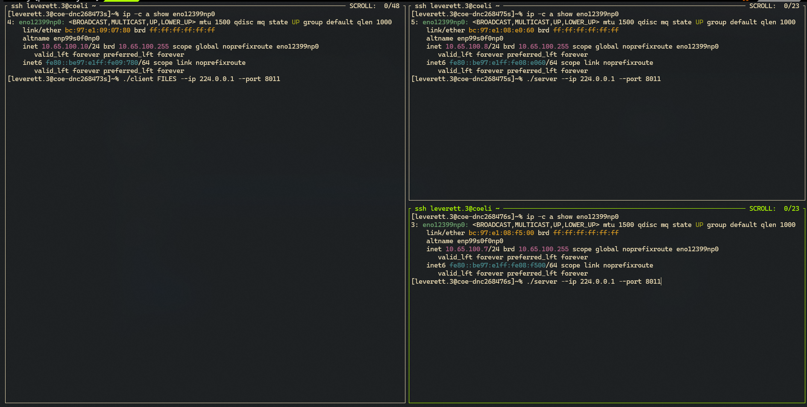
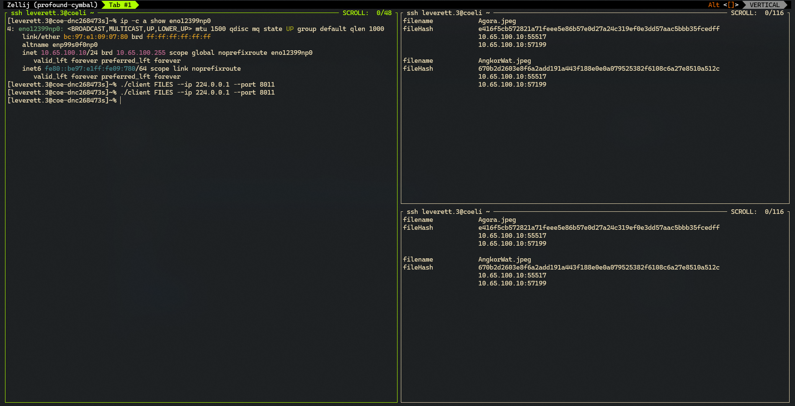
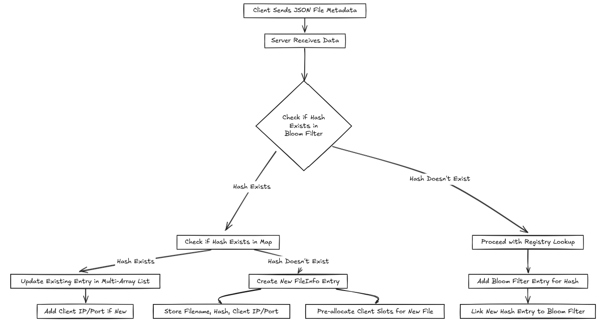

# Project 5: Server-Side File Sharing System with Client Tracking

[](https://github.com/CSE-5462-OSU-Spring2025/lab5-jlevere/actions/workflows/release.yaml)


## Intro

Expand the server functionality developed in Project #3 to handle multiple clients registering files, with the server keeping track of which clients possess each file based on unique file hashes.


## Contents
- Assignment [details](ASSIGNMENT.md)
- [Getting Started](#getting-started)
- [Design](#design)
- [Testing](#testing) [](https://github.com/CSE-5462-OSU-Spring2025/lab5-jLevere/actions/workflows/main.yaml)


## Getting Started


To compile the code you have a few options, use the [development enviroment](#enviroment-setup), or [directly install](#direct-zig-install) the zig compiler.

### Environment setup (HIGHLY RECOMMENDED)

To use the Nix flake-based development environment:
```bash
direnv allow  # or
nix develop
```

This will ensure that the LSP, compiler and library versions are all in sync using the `flake.lock` file.

To learn more about how awesome nix is, see [how-nix-works](https://nixos.org/guides/how-nix-works/) and the [nix-installer](https://github.com/DeterminateSystems/nix-installer).

### Direct Zig Install

For MacOS (via Homebrew):
```bash
brew install zig  # v0.13.0 (0.14.0-dev.2851+b074fb7dd recommended)
```
Other systems: [Download binaries](https://ziglang.org/learn/getting-started/) or check [supported package managers](https://github.com/ziglang/zig/wiki/Install-Zig-from-a-Package-Manager).

### Compilation & Usage

Compile with `zig build` or download pre-built binaries from [releases](https://github.com/CSE-5462-OSU-Spring2025/lab2-jLevere/releases/latest/).

### Usage


```
./server 224.0.0.1 8011
```

```
./client FILES/ --ip 224.0.0.1 --port 8011
```






## Design

While I slightly deviated from the design proposed in the [assignment](./ASSIGNMENT.md), I ensured that all functional and interoperability requirements were still met.

This project was implemented with **Data-Oriented Design** principles in mind, focusing on performance and efficient memory usage.

### Internal Data Structure

The server uses a **Multi-Array List** as its core data structure. This structure organizes data by storing separate lists for each field of the struct it is designed for. This approach offers two key benefits:
- **Memory efficiency**: It reduces the overhead by organizing data in a more compact way.
- **Performance improvements**: The layout improves cache locality and allows us to take advantage of **SIMD** (Single Instruction, Multiple Data) for parallel processing of operations.

### Key Operations

The most common operations in the file registry are:
1. Checking if a hash is present in the registry (`contains hash`).
2. Retrieving clients associated with a given hash (`retrieve clients from hash`).
3. Adding a new client (`add new client`).
4. Adding a new file (`add new file`).

Each of these operations starts with a check to see if the registry contains the hash, making this check the most frequent operation.

### Optimizing Hash Lookups

To speed up hash lookups, we use a **Bloom Filter** for **negative lookups**. This prevents unnecessary lookups in the main data structure. Additionally, we use a **hashmap** to map hashes directly to entries in the main data structure, the Multi-Array List.

This combination allows for:
- **Constant time lookups** for checking if a hash exists.
- **Efficient membership tests** for hashes.

These optimizations efficiently handle the "contains hash" and "retrieve clients from hash" operations.

### Handling New Files

When a new file is added, we assume that it will be associated with multiple clients. To optimize for this, we pre-allocate a few client slots in advance. Clients are stored as `std.net.Address` objects, which are relatively small and already stored in an array list.

This approach reduces overhead and further optimizes the most frequent operations, ensuring that we handle hash lookups and client retrieval efficiently.


### Workflow



### JSON Object Structure
Each JSON object should contain:
- `"filename"`: Original filename of the file.
- `"fileSize"`: Total size of the file in bytes.
- `"numberOfChunks"`: Number of chunks the file was split into.
- `"chunk_hashes"`: Array of SHA-256 hashes for each chunk.
- `"fullFileHash"`: SHA-256 hash for the entire file.

```json
     {
       "filename": "ExampleFile.jpeg",
       "fileSize": 1234567,
       "numberOfChunks": 6,
       "chunk_hashes": [
         "hash_chunk_1",
         "hash_chunk_2",
         ...
       ],
       "fullFileHash": "hash_for_whole_file"
     }
```

A json schema document is defined in [schema.json](./docs/schema.json).

## Testing
**Unit Tests:**
```bash
zig build test --summary all
```
