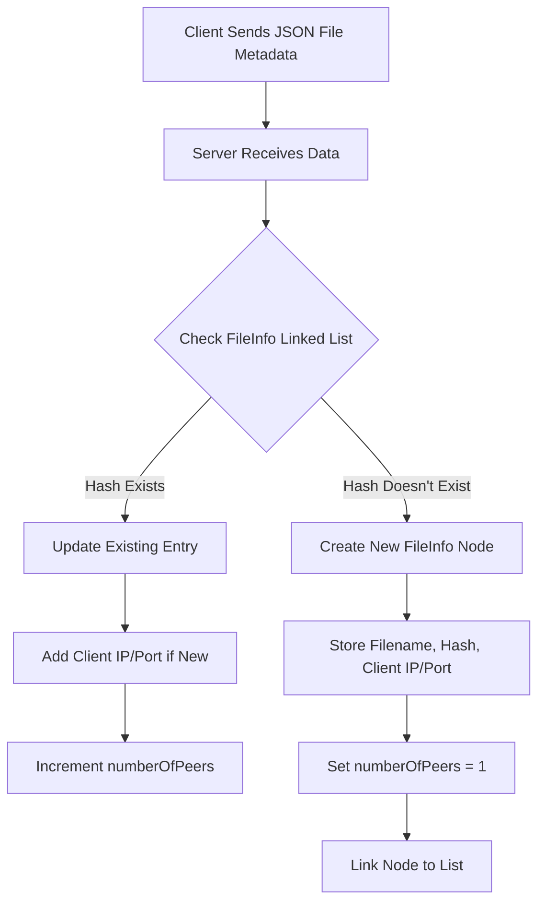

# Project 5: Server-Side File Sharing System with Client Tracking

[](https://github.com/CSE-5462-OSU-Spring2025/lab5-jlevere/actions/workflows/release.yaml)


## Intro

Expand the server functionality developed in Project #3 to handle multiple clients registering files, with the server keeping track of which clients possess each file based on unique file hashes.


## Contents
- Assignment [details](ASSIGNMENT.md)
- [Getting Started](#getting-started)
- [Design](#design)
- [Testing](#testing) [](https://github.com/CSE-5462-OSU-Spring2025/lab5-jLevere/actions/workflows/main.yaml)


## Getting Started


To compile the code you have a few options, use the [development enviroment](#enviroment-setup), or [directly install](#direct-zig-install) the zig compiler.

### Enviroment setup (HIGHLY RECOMENDED)

To use the Nix flake-based development environment:
```bash
direnv allow  # or
nix develop
```

This will ensure that the LSP, compiler and library versions are all in sync using the `flake.lock` file.

To learn more about how awesome nix is, see [how-nix-works](https://nixos.org/guides/how-nix-works/) and the [nix-installer](https://github.com/DeterminateSystems/nix-installer).

### Direct Zig Install

For MacOS (via Homebrew):
```bash
brew install zig  # v0.13.0 (0.14.0-dev.2851+b074fb7dd recommended)
```
Other systems: [Download binaries](https://ziglang.org/learn/getting-started/) or check [supported package managers](https://github.com/ziglang/zig/wiki/Install-Zig-from-a-Package-Manager).

### Compilation & Usage

Compile with `zig build` or download pre-built binaries from [releases](https://github.com/CSE-5462-OSU-Spring2025/lab2-jLevere/releases/latest/).

### Usage


```
./server 224.0.0.1 8011
```

```
./client 224.0.0.1 8011 input.txt
```


## Design


### Workflow


## Testing
**Unit Tests:**
```bash
zig build test
```

