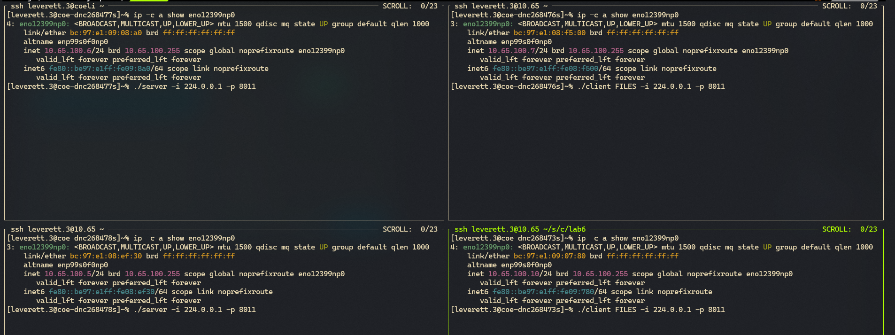
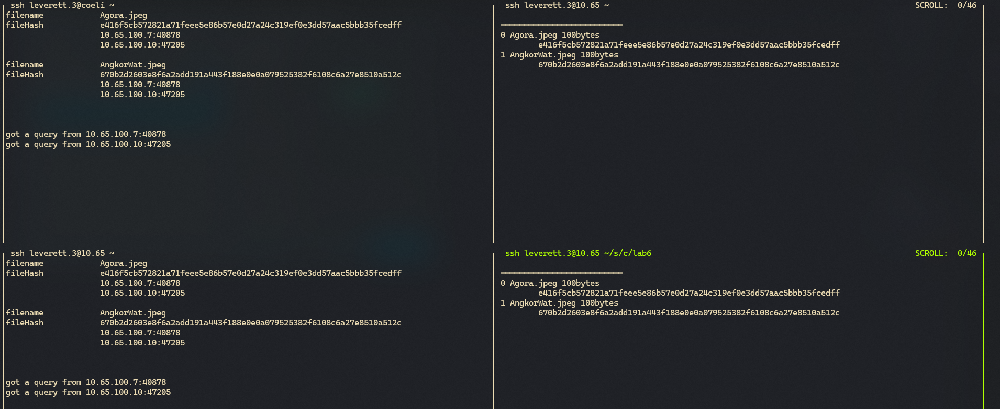

# Project #7: Distributed File Retrieval and Reconstruction with Validation

## Intro

This project implements a distributed file retrieval system where clients directly retrieve file chunks from peer clients using server-provided metadata, validate each chunk's integrity, and reconstruct the complete file. The system ensures data integrity through SHA-256 validation at both chunk and file levels, enabling resilient peer-to-peer communication and accurate reconstruction of files in a decentralized environment.

## Contents

- Assignment [details](ASSIGNMENT.md)
- [Getting Started](#getting-started)
- [Design](#design)
- [Testing](#testing) [](https://github.com/CSE-5462-OSU-Spring2025/lab6-jLevere/actions/workflows/main.yaml)

## Getting Started

To compile the code you have a few options, use the [development enviroment](#enviroment-setup), or [directly install](#direct-zig-install) the zig compiler.

### Environment setup (HIGHLY RECOMMENDED)

To use the Nix flake-based development environment:

```bash
direnv allow  # or
nix develop
```

This will ensure that the LSP, compiler and library versions are all in sync using the `flake.lock` file.

To learn more about how awesome nix is, see [how-nix-works](https://nixos.org/guides/how-nix-works/) and the [nix-installer](https://github.com/DeterminateSystems/nix-installer).

### Direct Zig Install

For MacOS (via Homebrew):

```bash
brew install zig  # v0.13.0 (0.14.0-dev.2851+b074fb7dd recommended)
```

Other systems: [Download binaries](https://ziglang.org/learn/getting-started/) or check [supported package managers](https://github.com/ziglang/zig/wiki/Install-Zig-from-a-Package-Manager).

### Compilation & Usage

Compile with `zig build` or download pre-built binaries from [releases](https://github.com/CSE-5462-OSU-Spring2025/lab2-jLevere/releases/latest/).

### Usage

```
./server 224.0.0.1 8011
```

```
./client FILES/ --ip 224.0.0.1 --port 8011
```


## Design

### Workflow




### JSON Object Structure

## Testing

**Unit Tests:**

```bash
zig build test --summary all
```


## Notes

This has taken me forever to really understand multicast in this application, omg.

| Role       | Bind Address     | Send To                      | Join Multicast?           | Receive From            |
| ---------- | ---------------- | ---------------------------- | ------------------------- | ----------------------- |
| **Server** | `0.0.0.0:8011`   | Unicast (Client IP)          | Yes (`IP_ADD_MEMBERSHIP`) | Multicast (`239.1.1.1`) |
| **Client** | `0.0.0.0:<rand>` | Multicast (`239.1.1.1:8011`) | No                        | Unicast (Server IP)     |
